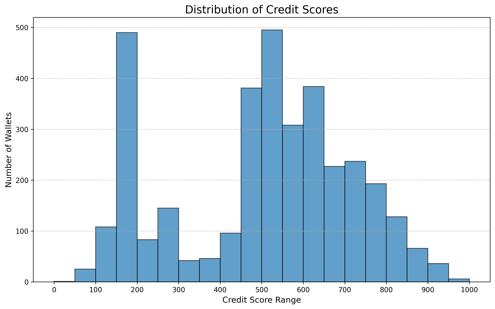

# DeFi Wallet Credit Score Analysis

This document provides an analysis of the wallet credit scores generated by the DeFi credit scoring model.

## Overview

**Total wallets analyzed:** 3,497

**Average credit score:** 503.00

**Median credit score:** 523.00

**Standard deviation:** 214.28

## Score Distribution

The following graph shows the distribution of credit scores across all wallets:



## Score Categories

- **Low Risk (800-1000):** 236 wallets (6.7%)
- **Medium Risk (200-799):** 2,637 wallets (75.4%)
- **High Risk (0-199):** 624 wallets (17.8%)

## High Risk Wallets (Score < 200)

High risk wallets typically exhibit:
- Higher likelihood of liquidations
- Poor repayment behavior
- Limited transaction history
- Lower overall transaction volumes

### Statistical Summary:

```
       transaction_count         first_transaction_date          last_transaction_date  total_volume_usd  wallet_age_days      Borrow     Deposit  LiquidationCall  RedeemUnderlying       Repay  Borrow_total_usd  Deposit_total_usd  LiquidationCall_total_usd  RedeemUnderlying_total_usd  Repay_total_usd  repay_to_borrow_ratio  redeem_to_deposit_ratio  credit_score
count         624.000000                            624                            624      6.240000e+02       624.000000  624.000000  624.000000       624.000000        624.000000  624.000000      6.240000e+02       6.240000e+02                      624.0                6.240000e+02     6.240000e+02             624.000000             6.240000e+02    624.000000
mean            2.089744  2021-07-16 21:01:29.211538432  2021-07-18 11:07:07.769230592      4.783505e+19         1.479167    0.258013    1.325321         0.073718          0.280449    0.152244      1.050480e+19       2.638947e+19                        0.0                5.646627e+18     5.294155e+18               0.014388             3.292879e+10    159.560897
min             1.000000            2021-04-14 18:18:28            2021-04-14 18:18:28      9.236938e+01         0.000000    0.000000    0.000000         0.000000          0.000000    0.000000      0.000000e+00       0.000000e+00                        0.0                0.000000e+00     0.000000e+00               0.000000             0.000000e+00      0.000000
25%             1.000000            2021-07-14 16:58:11            2021-07-18 02:43:42      1.058893e+06         0.000000    0.000000    1.000000         0.000000          0.000000    0.000000      0.000000e+00       9.922440e+05                        0.0                0.000000e+00     0.000000e+00               0.000000             0.000000e+00    166.000000
50%             1.000000            2021-07-19 04:14:28            2021-07-20 11:17:32      1.117944e+06         0.000000    0.000000    1.000000         0.000000          0.000000    0.000000      0.000000e+00       1.105466e+06                        0.0                0.000000e+00     0.000000e+00               0.000000             0.000000e+00    167.000000
75%             2.000000     2021-07-23 13:29:44.500000            2021-07-23 18:04:17      2.188859e+06         0.000000    0.000000    1.000000         0.000000          0.000000    0.000000      0.000000e+00       1.676534e+06                        0.0                0.000000e+00     0.000000e+00               0.000000             0.000000e+00    174.000000
max           366.000000            2021-09-02 16:58:36            2021-09-02 16:58:36      2.165380e+22        51.000000  117.000000  111.000000        26.000000         34.000000   78.000000      3.313269e+21       1.497963e+22                        0.0                3.018041e+21     2.960695e+21               2.007178             6.487601e+12    199.000000
std            15.064707                            NaN                            NaN      9.263589e+20         3.814252    4.845521    4.492719         1.248183          1.656701    3.145109      1.854139e+20       6.025190e+20                        0.0                1.224690e+20     1.192928e+20               0.142504             3.396353e+11     29.629052
```

## Low Risk Wallets (Score >= 800)

Low risk wallets demonstrate:
- Clean liquidation history
- Strong repayment behavior
- Established transaction patterns
- Higher transaction volumes

### Statistical Summary:

```
       transaction_count         first_transaction_date          last_transaction_date  total_volume_usd  wallet_age_days      Borrow     Deposit  LiquidationCall  RedeemUnderlying       Repay  Borrow_total_usd  Deposit_total_usd  LiquidationCall_total_usd  RedeemUnderlying_total_usd  Repay_total_usd  repay_to_borrow_ratio  redeem_to_deposit_ratio  credit_score
count          236.00000                            236                            236      2.360000e+02       236.000000  236.000000  236.000000       236.000000        236.000000  236.000000      2.360000e+02       2.360000e+02                      236.0                2.360000e+02     2.360000e+02           2.360000e+02               236.000000    236.000000
mean           161.54661  2021-05-09 23:52:20.572033536  2021-08-21 09:44:25.627118848      2.344184e+24       102.919492   32.898305   70.360169         0.076271         31.156780   27.055085      5.638747e+23       9.778675e+23                        0.0                5.165918e+23     2.858498e+23           5.136888e-01                 0.575647    853.716102
min              4.00000            2021-03-31 17:00:04            2021-06-12 06:33:06      3.850633e+20        42.000000    0.000000    2.000000         0.000000          0.000000    0.000000      0.000000e+00       2.550528e+20                        0.0                0.000000e+00     0.000000e+00           0.000000e+00                 0.000000    800.000000
25%             47.00000  2021-04-25 00:44:29.249999872  2021-08-17 13:47:47.750000128      3.466312e+22        86.000000    8.000000   20.000000         0.000000          7.000000    4.000000      9.263891e+19       1.815166e+22                        0.0                1.988363e+21     2.039189e+10           2.119868e-10                 0.108455    818.000000
50%            108.50000     2021-05-05 05:14:44.500000     2021-08-29 19:00:44.500000      1.277582e+23       103.000000   20.000000   46.000000         0.000000         16.000000   13.500000      4.940797e+21       7.819533e+22                        0.0                2.523365e+22     6.069040e+20           5.171569e-01                 0.443719    845.000000
75%            207.00000     2021-05-26 20:08:18.500000     2021-09-01 20:31:54.500000      6.156036e+23       119.000000   39.000000   87.250000         0.000000         37.250000   31.250000      6.022615e+22       3.324197e+23                        0.0                1.238976e+23     1.524905e+22           9.811542e-01                 0.859554    881.000000
max           1089.00000            2021-06-24 15:30:15            2021-09-02 17:44:25      9.573825e+25       153.000000  200.000000  511.000000         2.000000        234.000000  291.000000      3.090979e+25       4.168231e+25                        0.0                2.382445e+25     1.734344e+25           1.653038e+00                 6.869096   1000.000000
std            171.44138                            NaN                            NaN      1.023808e+25        20.910902   39.846384   78.691382         0.310299         39.035783   38.570537      2.793919e+24       4.106034e+24                        0.0                2.284998e+24     1.447506e+24           4.272725e-01                 0.709634     43.215441
```

## Methodology

The credit score is calculated using the following factors:
- **Wallet Age (15%):** Time since first transaction
- **Transaction Count (10%):** Total number of transactions
- **Transaction Volume (15%):** Total USD value of transactions
- **Repayment Ratio (25%):** Ratio of repayments to borrows
- **Deposit Activity (20%):** Total deposit amounts
- **Liquidation Penalty (-35%):** Penalty for liquidation events

Scores are normalized to a 0-1000 scale where higher scores indicate lower risk.
